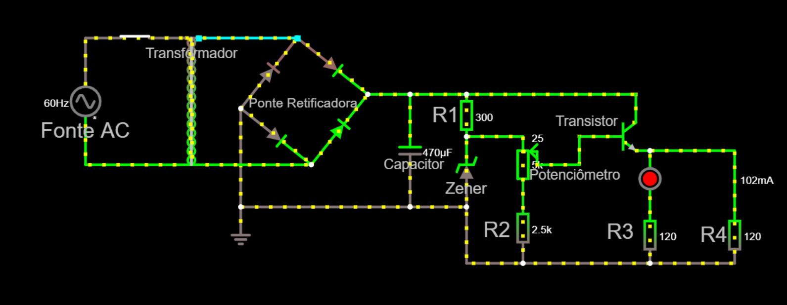
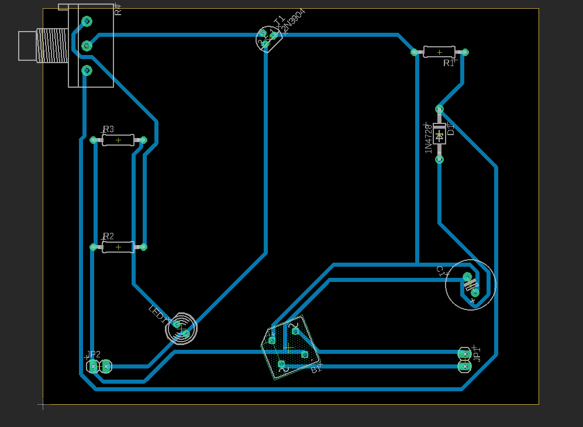

## Objetivo do Projeto
Desenvolver uma fonte elétrica capaz de fornecer energia para pequenos projetos de eletrônica, como projetos de Arduino.
Por conta disso ela deve seguir os critérios a seguir

## Critérios da Fonte
- Componentes elétricos simples
- Tensão Ajustável através de um potenciômetro (3v - 12v)
- Corrente de 100mA

## Precificação dos Componentes
| Componente                      | Quantidade | Preço   | Link                                                                            |
|---------------------------------|------------|---------|---------------------------------------------------------------------------------|
| Transformador 127/220AC -> 15v  | 1          | R$33,15 | [aqui](https://www.baudaeletronica.com.br/transformador-trafo-1a-15v-15v.html)  |
| Diodo Zener 1N4743 13v          | 1          | RS 0,35 | [aqui](https://www.mamuteeletronica.com.br/diodo-zener-1n4743-13v-1w-do-41)     |
| Ponte Retificadora 10A 100V     | 1          | R$ 6,66 | [aqui](https://www.casadoresistor.com.br/ponte-retificadora-10a-1000v-zcdp0003-p4727)                    |
| Potenciômetro Linear 5k R       | 1          | R$ 1,09 | [aqui](https://www.baudaeletronica.com.br/potenciometro-linear-de-5k-5000.html) |
| Transistor NPN 2N222            | 1          | R$ 0,35 | [aqui](https://www.autocorerobotica.com.br/2n222-transistor-npn)                |
| Capacitor 470uf                 | 1          | R$ 1,00 | [aqui](https://www.tecnotronics.com.br/capacitor-eletrolitico-470uf-25v.html)   |
| Resistor 2k R                   | 1          | R$ 0,08 | [aqui](https://www.baudaeletronica.com.br/resistor-2k-5-1-4w.html)              |
| Resistor 300R                   | 1          | R$ 0,08 | [aqui](https://www.baudaeletronica.com.br/resistor-300r-5-1-4w.html)            |
| Resistor 120R                   | 2          | R$ 0,08 | [aqui](https://www.baudaeletronica.com.br/resistor-120r-5-1-4w.html)            |
| LED Difuso Vermelho             | 1          | R$ 0,24 | [aqui](https://www.baudaeletronica.com.br/led-difuso-5mm-vermelho.html)         |
| Total                           |            | R$43,16 |                                                                                 |
## Circuito no Falstad

- Link para o circuito: http://tinyurl.com/y77v26rw

## Detalhes do Circuito

## EAGLE - Esquemâtico e PCB
### Esquemático

### PCB

